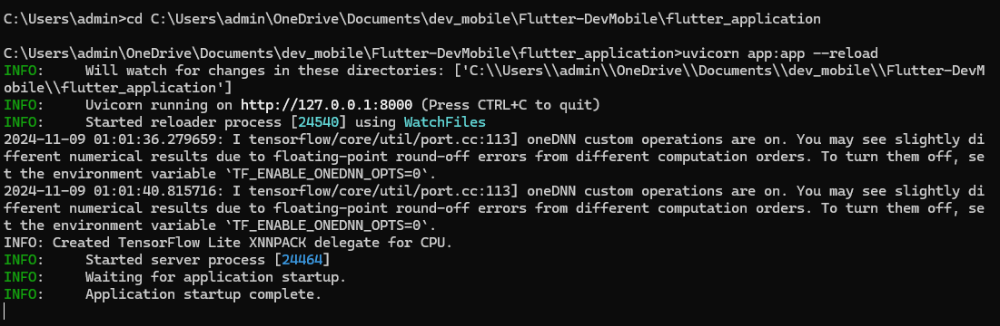
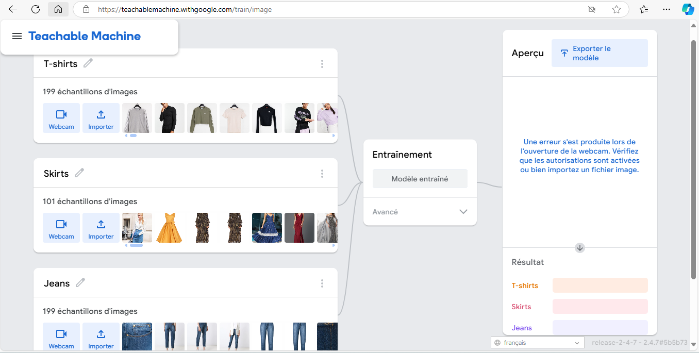

# Projet Flutter DevMobile

## Réalisateur : Tuan Linh Dao (le compte "MokhtarSamy" - l'ordinateur emprunté/utilisé pour faire ce projet)

Ce référentiel contient une application mobile développée dans Flutter ainsi qu'un serveur backend construit avec FastAPI. Le serveur backend gère les requêtes API pour l'application et utilise un ensemble de dépendances spécifiées dans `requirements.txt`.

## Table des matières
- [A. Structure du projet](#a-structure-du-projet)
- [B. Prérequis](#b-prerequis)
- [C. Les étapes à suivre pour tester l'application](#c-les-etapes-a-suivre-pour-tester-lapplication)
- [D. Partie IA du projet](#d-partie-ia-du-projet)
---

## A. Structure du projet

Les principaux dossiers et fichiers de ce projet incluent :
- `flutter_application/` : contient tout le code de l'application Flutter.
- `Image pour tester/` : contient les images pour uploader sur l'application lorsqu'utilisateur veut ajouter nouveau vêtement dans sa liste (autrement dit tester la classification du modèle entraîné).
- `requirements.txt` : répertorie les dépendances Python pour le backend FastAPI.
- `README.md` : documentation du projet (ce fichier).

## B. Prérequis

Pour exécuter et tester cette application, assurez-vous que les éléments suivants sont installés :

- **Flutter** : suivez le [guide d'installation de Flutter](https://flutter.dev/docs/get-started/install) pour votre système d'exploitation.
- **Python 3.7+** : requis pour exécuter le backend FastAPI.
- **pip** : programme d'installation de package Python (fourni avec Python).
- **Git** : contrôle de version pour cloner le référentiel.

## C. Les étapes à suivre pour tester l'application

### 1. Cloner le référentiel

```bash
git clone https://github.com/Linhkobe/Flutter-DevMobile.git
cd Flutter-DevMobile
```

### 2. Démarrer python backend

#### 2.3 installer les dépendances de python

```bash
pip install -r requirements.txt 
```

#### 2.4 Lancement de fastapi (Ouvrez cmd - Invite de commandes)

#### 2.4.1 Naviguez en suivant ce chemin vers le projet (selon l'nregistrement du projet sur votre ordinateur)

```bash
cd C:...\Flutter-DevMobile\flutter_application 
```
#### 2.4.2 Lancez le server en suivant ces sous-étapes

#### Installez uvicorn
```bash
pip install uvicorn
```

#### Installez python-multipart
```bash
pip install python-multipart
```

#### Installez fastapi
```bash
pip install fastapi
```

#### Finallement lancer le serveur
```bash
uvicorn app:app --reload
```

### Une fois le serveur est lancé, vérifiez votre cmd comme l'image suivant 


### 3. Lancement de flutter application

#### 3.1 Naviguez vers répertoire "flutter_application" du projet
```bash
cd flutter_application
```

#### 3.2 Installer les dépendances de flutter
```bash
flutter pub get 
```

#### 3.3 Lancer l'application (choisir votre navigateur préféré)
```bash
flutter run
```

### 4. Liste des users et leur mot de passe pour l'authentification

=================================

#### 4.1 Utilisateur 1

#### login: tester2
#### Mot de passe : passcode567

=================================

#### 4.2 Utilisateur 2

#### login: tester 
#### Mot de passe : passcode234

==================================

## D. Partie IA du projet

### Le but de l'utilisation d'IA est permettre utilisateur de classifier la catégorie de vêtement à partir d'une image uploadée sur l'application.

### D.1 Les données utilisées pour entraîner le modèle

- Les données sont récupérées grâce à [ce lien du Kaggle](https://www.kaggle.com/datasets/sunnykusawa/cloth-dataset/data) , ici on a deux classes Jeans et T-shirts.

- Une autre classe "Skirts" a été créée (l'enregistrement de l'ensemble des images sur internet).

- Donc les données comprenent 3 classes : Jeans, T-shirts, Skirts

#### D.2 L'entraînement du modèle
- L'entraînement du modèle a été réalisé par [ce lien](https://teachablemachine.withgoogle.com/train)

- Les images ont été uploadées manuellement sur la page, aussi on peut saisir le nom des classes
