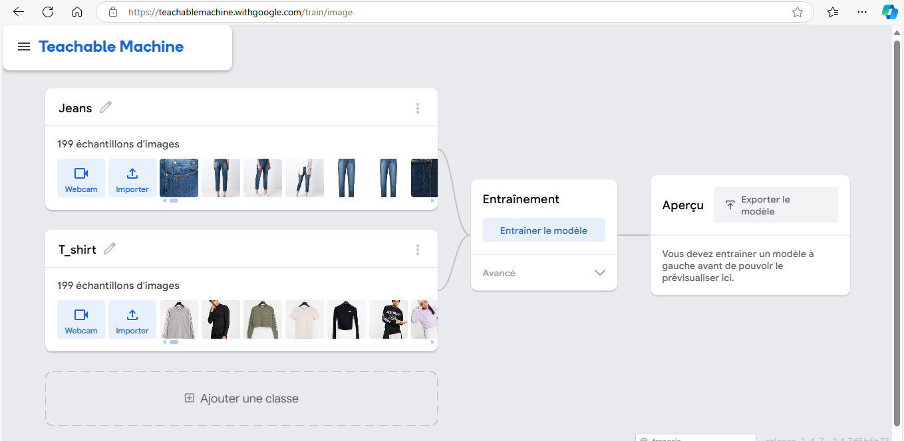

# Projet Flutter DevMobile

Ce référentiel contient une application mobile développée dans Flutter ainsi qu'un serveur backend construit avec FastAPI. Le serveur backend gère les requêtes API pour l'application et utilise un ensemble de dépendances spécifiées dans `requirements.txt`.

## Table des matières
- [A. Structure du projet](#project-structure)
- [B. Prérequis](#prerequis)
- [C. Les étapes à suivre pour tester l'application](#etape)
- [D. Partie IA du projet](#AI)
---

## A. Structure du projet

Les principaux dossiers et fichiers de ce projet incluent :
- `flutter_application/` : contient tout le code de l'application Flutter.
- `requirements.txt` : répertorie les dépendances Python pour le backend FastAPI.
- `README.md` : documentation du projet (ce fichier).

## B. Prérequis

Pour exécuter et tester cette application, assurez-vous que les éléments suivants sont installés :

- **Flutter** : suivez le [guide d'installation de Flutter](https://flutter.dev/docs/get-started/install) pour votre système d'exploitation.
- **Python 3.7+** : requis pour exécuter le backend FastAPI.
- **pip** : programme d'installation de package Python (fourni avec Python).
- **Git** : contrôle de version pour cloner le référentiel.

## C. Les étapes à suivre pour tester l'application

### 1. Cloner le référentiel

```bash
git clone https://github.com/Linhkobe/Flutter-DevMobile.git
cd Flutter-DevMobile
```

### 2. Démarrer python backend

#### 2.1 Création de l'environnement virtuel de python

```bash
python -m venv venv
```

#### 2.2 Activez l'environnement virtuel de python

```bash
venv\Scrips\activate
``` 

#### 2.3 installer les dépendences de python

```bash
pip install -r requirements.txt 
```

#### 2.4 Lancement de fastapi (Ouvrez cmd - Invite de commandes)

#### 2.4.1 Naviguez en suivant ce chemin vers le projet

```bash
cd C:\Users\admin\OneDrive\Documents\dev_mobile\Flutter-DevMobile\flutter_application 
```
#### 2.4.2 Lancez le server
```bash
uvicorn app:app --reload
```

### 3. Lancement de flutter application

#### 3.1 Naviguez vers répertoire "flutter_application" du projet
```bash
cd flutter_application
```

#### 3.2 Installer les dépendences de flutter
```bash
flutter pub get 
```

#### 3.3 Lancer l'application
```bash
flutter run
```
## D. Partie IA du projet

### D.1 Les données utilisées pour entraîner le modèle

- Les données sont récupérées grâce à [ce lien du Kaggle](https://www.kaggle.com/datasets/sunnykusawa/cloth-dataset/data)

- En gros, les données comprenent 2 classes : Jeans et T-shirts

#### D.2 L'entraînement du modèle
- L'entraînement du modèle a été réalisé par [ce lien](https://teachablemachine.withgoogle.com/train)

- Les images ont été uploadées manuellement sur la page, aussi on peut saisir le nom des classes
